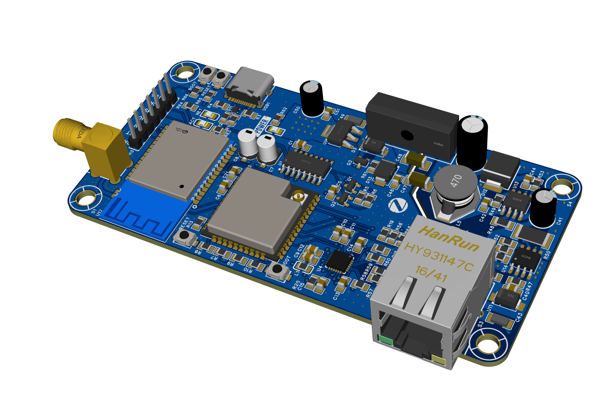
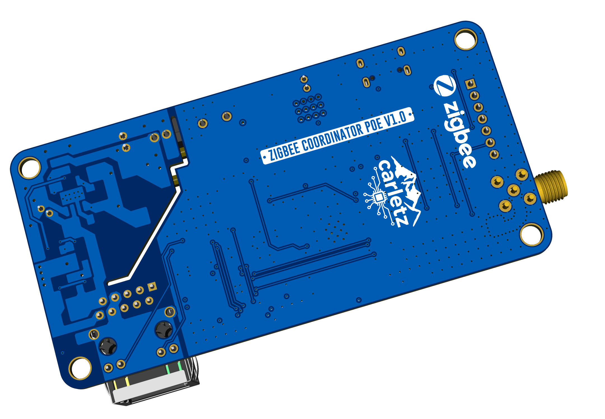

# Zigbee Coordinator with Ethernet and PoE Support

This project is a custom-designed Zigbee Coordinator board integrating **ESP32**, **Zigbee RF module (RF-BM-2652P2)**, and **Ethernet with Power over Ethernet (PoE)** capabilities. It is optimized for smart home or industrial IoT gateway applications, and provides a compact, PoE-powered solution for reliable Zigbee-to-IP bridging.

## Features

- **ESP32-WROOM-32UE** microcontroller with Wi-Fi and Bluetooth
- **Zigbee RF module (CC2652-based)** for Zigbee 3.0 coordination
- **LAN8720A Ethernet PHY** connected to ESP32 via RMII
- **PoE power supply** using TPS2376DDAR IEEE 802.3af-compliant PD controller
- Fully isolated and filtered power stages for 3.3V and 5V rails
- **CH340C USB-UART converter** for easy flashing/debugging
- USB Type-C input with ESD protection
- JTAG and serial debug headers
- LEDs for link/activity indication
- Compact design ready for fabrication via JLCPCB

## Project Structure

The electrical schematic is divided into the following pages:
1. **Ethernet & PoE**: LAN8720A, RJ45 + magnetics, PoE PD and DC/DC conversion
2. **Controller**: ESP32 core, CH340C UART, USB input, power rails
3. **Zigbee Module**: RF-BM-2652P2, antenna, buttons, debug interfaces

## Tools & Compatibility

- Designed in **EasyEDA**
- Compatible with **Zigbee2MQTT**, **Home Assistant**, **OpenHAB**, and other automation platforms
- ESP32 flashable via USB or UART boot mode (IO0 + EN)
- Zigbee module (CC2652P2) flashable via UART bridge with ESP32

## Flashing Instructions

### ESP32
1. Flash the ESP32 using a serial tool or over USB with your preferred firmware (e.g., ESPHome, custom UART bridge, etc.).
   A special thanks to the work of [ZigStar](https://zig-star.com/) crew where I took a lot of inspiration

### CC2652P2 Zigbee Module
1. Use the ESP32 to create a UART bridge to the CC2652P2 module.
2. Access the ESP32 on the configured IP address via TCP/UDP.
3. Download the appropriate Zigbee coordinator firmware from (in dev branch folder):
   [Koenkk Z-Stack firmware](https://github.com/Koenkk/Z-Stack-firmware/tree/dev/coordinator/Z-Stack_3.x.0/bin)
4. Flash the CC2652P2 using tools like `cc2538-bsl` or TI's SmartRF Flash Programmer through the ESP32 UART bridge.

## Getting Started

1. Assemble the PCB using the schematic and a compatible BOM.
2. Flash ESP32 and configure the Zigbee module as described above.
3. Connect the board via Ethernet or Wi-Fi.
4. Integrate with your MQTT broker and Zigbee network.

## License

This project is open hardware, released under the MIT License.
